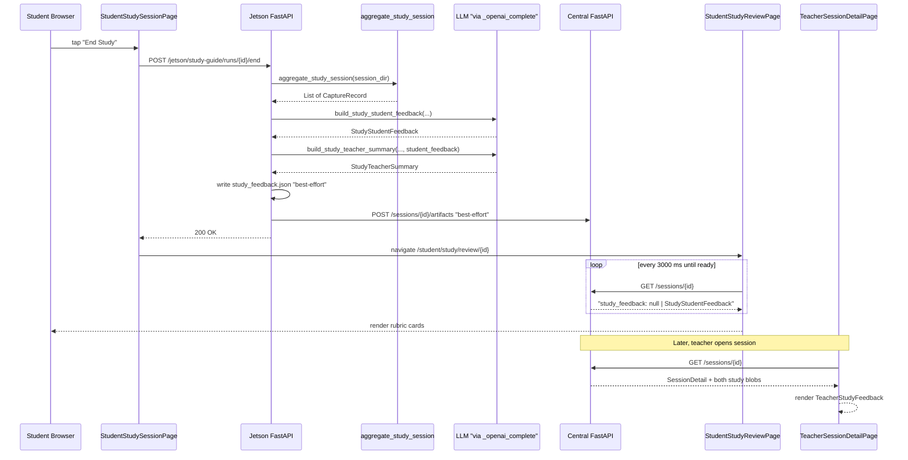
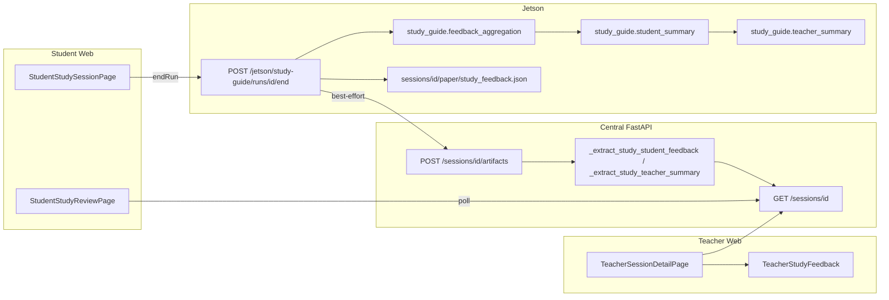

# Post-Session Study Feedback Pipeline — Design (Socrates)

This document captures the end-to-end design of the **post-session study feedback** feature: a Jetson-triggered aggregation + LLM pass that turns a completed study run into a three-section student summary (High-level takeaways, Areas to improve, Next Steps) plus a short instructor summary, surfaced on both the student and teacher web UIs. The student-facing report is a **summarization of the per-capture in-session feedback** rather than a fresh grade — the LLM's only job at this stage is to roll up what the mid-session vision grader already produced into a digestible three-section report.

**Implementation in this repo:** Jetson endpoint `POST /jetson/study-guide/runs/{id}/end`, Python package [`jetson_runtime/study_guide/`](../jetson_runtime/study_guide/), central-backend persistence in [`backend/routes/sessions.py`](../backend/routes/sessions.py) + [`backend/schemas.py`](../backend/schemas.py), and a new student review page + teacher-side component under [`web/src/`](../web/src/).

**Scope boundary:** study mode only. The oral-exam pipeline (`/jetson/exams/*`, [`jetson_runtime/proctor.py`](../jetson_runtime/proctor.py), [`web/src/pages/StudentSessionPage.tsx`](../web/src/pages/StudentSessionPage.tsx)) is **not** touched by this feature. Exam-mode sessions read through all the same central endpoints and the new fields default to `null`, so they render identically to before.

---

## 1. Overview and motivation

During a study run, the student takes one or more photos of their paper work; each photo is graded by the vision model immediately (the earlier "paper feedback" loop from `f9d431d`). What was missing was a **digestible end-of-run summary** that pulled every capture's feedback into one place, and a short **instructor-facing narrative** the teacher could consume without rewatching the whole session.

The post-session study feedback feature closes that gap:

1. When the student taps **End Study**, the Jetson aggregates every capture for that run, asks the LLM to produce (a) a three-section student summary (High-level takeaways, Areas to improve, Next Steps) grounded in the per-capture grader output and (b) an instructor rollup, writes both to disk, and POSTs both to the central backend as session artifacts.
2. The student is navigated to a new review page that polls central and renders the three standardized narrative sections as bulleted lists.
3. On `/teacher/sessions/:sessionId`, a new component renders the instructor narrative plus a mirror of the same three sections the student sees, only when the session actually has study-feedback artifacts (otherwise it returns `null`).

The feature is intentionally a sibling-of, **not** a replacement-of, the earlier per-capture paper-vision loop: mid-session feedback still comes from the vision model, and post-session feedback is a *summarization* of that per-capture feedback.

---

## 2. Commit of record

- Author: **AlfredYu106**
- Commit: **`aeb2ffb`** — "Added post sessio nstudy information - the Jetson will generate per-rubric student feedback and a teacher narrative when the student presses End Study. Included test files for PR quality check."
- Follow-up merge: `6b25fc0` (Merge pull request #39 from `cs210/feedback-format-v2`).
- Prior related: `f9d431d` ("Add study prep/session UI, paper feedback study guide, evidence pipeline updates") — introduced the per-capture paper-vision loop that this feature builds on.

---

## 3. File inventory

Grouped by layer. Sizes are the line-count deltas from `git show --stat aeb2ffb`.

### Jetson backend (new aggregation + LLM + endpoint)

| File | Status | Delta | Role |
|---|---|---:|---|
| [`jetson_runtime/jetson_backend.py`](../jetson_runtime/jetson_backend.py) | modified | +96 | Adds `POST /jetson/study-guide/runs/{id}/end` (lines 408-473) |
| [`jetson_runtime/study_guide/feedback_aggregation.py`](../jetson_runtime/study_guide/feedback_aggregation.py) | new | 130 | Walks `sessions/<id>/paper/` into ordered `CaptureRecord`s |
| [`jetson_runtime/study_guide/feedback_contracts.py`](../jetson_runtime/study_guide/feedback_contracts.py) | new | 255 | TypedDicts, defensive defaults, LLM-JSON parsers |
| [`jetson_runtime/study_guide/student_summary.py`](../jetson_runtime/study_guide/student_summary.py) | new | 155 | Builds `StudyStudentFeedback` from captures |
| [`jetson_runtime/study_guide/teacher_summary.py`](../jetson_runtime/study_guide/teacher_summary.py) | new | 139 | Builds `StudyTeacherSummary` (uses student result as grounding) |
| [`jetson_runtime/study_guide/tests/__init__.py`](../jetson_runtime/study_guide/tests/__init__.py) | new | 1 | Test package marker |
| [`jetson_runtime/study_guide/tests/test_end_endpoint.py`](../jetson_runtime/study_guide/tests/test_end_endpoint.py) | new | 206 | Exercises the full `/end` endpoint with mocked LLM |
| [`jetson_runtime/study_guide/tests/test_feedback_aggregation.py`](../jetson_runtime/study_guide/tests/test_feedback_aggregation.py) | new | 132 | Directory walking, ordering, missing-file fallbacks |
| [`jetson_runtime/study_guide/tests/test_feedback_contracts.py`](../jetson_runtime/study_guide/tests/test_feedback_contracts.py) | new | 176 | TypedDict parsers and status coercion |
| [`jetson_runtime/study_guide/tests/test_student_summary.py`](../jetson_runtime/study_guide/tests/test_student_summary.py) | new | 169 | Prompt construction and LLM-failure fallback |
| [`jetson_runtime/study_guide/tests/test_teacher_summary.py`](../jetson_runtime/study_guide/tests/test_teacher_summary.py) | new | 133 | Same, for the teacher builder |

### Central backend (persist + surface)

| File | Status | Delta | Role |
|---|---|---:|---|
| [`backend/routes/sessions.py`](../backend/routes/sessions.py) | modified | +106 | Adds `_extract_study_*` helpers (lines 56-150) and wires them into `GET /sessions/{id}` (lines 368-369) |
| [`backend/schemas.py`](../backend/schemas.py) | modified | +6 | Adds `study_feedback` / `study_teacher_summary` to `SessionDetail` (lines 146-151) |
| [`backend/tests/__init__.py`](../backend/tests/__init__.py) | new | 1 | Test package marker |
| [`backend/tests/test_session_study_feedback_fields.py`](../backend/tests/test_session_study_feedback_fields.py) | new | 220 | Locks the `SessionDetail` shape through `GET /sessions/{id}` |

### Student web app

| File | Status | Delta | Role |
|---|---|---:|---|
| [`web/src/pages/StudentStudySessionPage.tsx`](../web/src/pages/StudentStudySessionPage.tsx) | modified | +33 | `End Study` now calls `studentStudyGuideApi.endRun` and navigates to `STUDENT_STUDY_REVIEW` (lines 346-376) |
| [`web/src/pages/StudentStudyReviewPage.tsx`](../web/src/pages/StudentStudyReviewPage.tsx) | new | 143 | Polls `GET /sessions/:id` and renders per-rubric rows |
| [`web/src/pages/StudentStudyReviewPage.module.css`](../web/src/pages/StudentStudyReviewPage.module.css) | new | 201 | Dark theme, status-pill colors (green/amber/red) |
| [`web/src/pages/StudentStudyReviewPage.test.tsx`](../web/src/pages/StudentStudyReviewPage.test.tsx) | new | 110 | Loader → ready transition, placeholder behavior |
| [`web/src/api/studentStudyGuide.ts`](../web/src/api/studentStudyGuide.ts) | modified | +18 | Adds `endRun(sessionId)` (lines 158-166) |
| [`web/src/api/studentStudyReview.ts`](../web/src/api/studentStudyReview.ts) | new | 56 | Collapses `GET /sessions/:id` into `StudyReview` (`pending` \| `ready`) |
| [`web/src/types/studyFeedback.ts`](../web/src/types/studyFeedback.ts) | new | 31 | TS mirror of the Python contracts |
| [`web/src/types/assessment.ts`](../web/src/types/assessment.ts) | modified | +11 | Re-exports study-feedback types, extends `SessionDetail` |
| [`web/src/routes/paths.ts`](../web/src/routes/paths.ts) | modified | +3 | Adds `STUDENT_STUDY_REVIEW = '/student/study/review/:sessionId'` |
| [`web/src/App.tsx`](../web/src/App.tsx) | modified | +2 | Registers the new route (line 50) |

### Teacher web app

| File | Status | Delta | Role |
|---|---|---:|---|
| [`web/src/components/TeacherStudyFeedback.tsx`](../web/src/components/TeacherStudyFeedback.tsx) | new | 131 | Renders instructor summary + per-rubric breakdown |
| [`web/src/components/TeacherStudyFeedback.module.css`](../web/src/components/TeacherStudyFeedback.module.css) | new | 170 | Dark-theme card styling, status pills |
| [`web/src/components/TeacherStudyFeedback.test.tsx`](../web/src/components/TeacherStudyFeedback.test.tsx) | new | 93 | Null-on-empty, rendering invariants |
| [`web/src/pages/TeacherSessionDetailPage.tsx`](../web/src/pages/TeacherSessionDetailPage.tsx) | modified | +6 | Imports + mounts `TeacherStudyFeedback` (lines 5, 173-176) |
| [`web/src/api/teacher.ts`](../web/src/api/teacher.ts) | modified | +14 | Surfaces `study_feedback` / `study_teacher_summary` on the teacher `SessionDetail` type (lines 190-191, 214-215; defaults on lines 93-94) |

### Other

- [`.gitignore`](../.gitignore) — +4 lines (session/runtime artifacts).

---

## 4. Data contracts

The Python source of truth is [`feedback_contracts.py`](../jetson_runtime/study_guide/feedback_contracts.py). The TypeScript mirror is [`web/src/types/studyFeedback.ts`](../web/src/types/studyFeedback.ts) — both sides must stay in sync.

### 4.1 Shapes

```python
# jetson_runtime/study_guide/feedback_contracts.py

class StudyStudentFeedback(TypedDict):
    question: str                      # the single study question
    high_level_takeaways: List[str]    # bullets - what the student did / understood
    areas_to_improve: List[str]        # bullets - specific gaps seen in captures
    next_steps: List[str]              # bullets - concrete actionable advice

class StudyTeacherSummary(TypedDict):
    summary: str             # 2-3 sentence instructor narrative
    flags: List[str]         # short risk/struggle bullets
    action_items: List[str]  # concrete next steps for the instructor
```

```ts
// web/src/types/studyFeedback.ts

export interface StudyStudentFeedback {
  question: string
  high_level_takeaways: string[]
  areas_to_improve: string[]
  next_steps: string[]
}

export interface StudyTeacherSummary {
  summary: string
  flags: string[]
  action_items: string[]
}
```

### 4.2 Defensive invariants

All parsing in the pipeline treats a malformed LLM response as *empty*, not as *broken*. Callers never have to handle exceptions:

- `empty_study_student_feedback(question)` returns a `StudyStudentFeedback` with three empty string arrays — every downstream UI can render a section with a per-section empty placeholder. (The legacy `rubric_items` second argument is still accepted for backwards compatibility but ignored.)
- `empty_study_teacher_summary()` returns `{summary: "", flags: [], action_items: []}`.
- `parse_study_student_response(raw, *, question)` strips `` ``` `` fences, tries `json.loads`, and coerces each of the three sections to a `List[str]` with empty / null entries dropped.
- `parse_study_teacher_response(raw)` does the same, dropping unrecognized list entries.

Central exposes the same guarantees through [`backend/routes/sessions.py`](../backend/routes/sessions.py) (`_extract_study_student_feedback`, `_extract_study_teacher_summary`; see §8).

---

## 5. Jetson backend: the `/end` endpoint

[`jetson_runtime/jetson_backend.py`](../jetson_runtime/jetson_backend.py) lines 408-473. Walkthrough of `end_study_run(session_id)`:

1. **Runtime lookup** (lines 425-428) — looks up the in-memory `_study_runs[session_id]` under `_lock`; returns 404 if the Jetson service restarted and lost the run.
2. **Aggregation** (lines 430-431) — resolves `session_dir = settings.SESSIONS_DIR / runtime.session_id / "paper"`, then `aggregate_study_session(session_dir)` returns the ordered `CaptureRecord` list (see §6).
3. **Student feedback** (lines 433-438) — calls `build_study_student_feedback(question_text, rubric_items, captures, llm_complete_fn=_openai_complete)` (see §7). Always returns a well-formed dict thanks to the fallback path.
4. **Teacher feedback** (lines 439-445) — calls `build_study_teacher_summary(..., student_feedback=student_fb, llm_complete_fn=_openai_complete)` — the student blob is an input so both surfaces use consistent language.
5. **Disk persistence** (lines 447-457) — writes `study_feedback.json` under `sessions/<id>/paper/`, best-effort (failure prints to stdout and continues).
6. **Central upload** (lines 459-469) — best-effort POST to `/sessions/{session_id}/artifacts` with:
   ```json
   {
     "artifacts": {
       "session_dir_uri": "...",
       "study_feedback": { ...StudyStudentFeedback... },
       "study_teacher_summary": { ...StudyTeacherSummary... },
       "mode": "study"
     }
   }
   ```
   `_post_central` already swallows network errors so a central outage never blocks the student.
7. **State update** (lines 471-473) — `runtime.status = "done"`, `runtime.finished_at = datetime.utcnow()`, returns `{"status": "ok"}`.

### Why every step is defensive

The student is navigated to the review page **regardless** of whether this endpoint succeeds. The review page polls central and will render a "preparing your feedback" loader forever if nothing shows up — which is the explicit, documented behavior. This isolates network / LLM / disk failures from the student's UX.

---

## 6. Aggregation module

[`feedback_aggregation.py`](../jetson_runtime/study_guide/feedback_aggregation.py). One public entry point:

```python
def aggregate_study_session(session_dir: Path) -> List[CaptureRecord]: ...
```

Behavior (lines 93-128):

- Globs `paper_*.jpg` under `session_dir`, sorts by `(mtime, name)` so ties are deterministic.
- For each image, attaches any sibling `paper_<ts>.json` / `paper_<ts>.md` if present (forward-compatible with a writer that emits per-timestamp files).
- Today's writer still overwrites one shared `paper_feedback.json` / `paper_feedback.md`; the aggregator attaches those to the **last** capture only if that capture didn't already pick up a per-timestamp file. This gives the LLM at least one grounded grade to reason about while preserving forward-compat.
- Empty/missing `session_dir` → returns `[]` (the downstream summary builders fall back to `empty_*`).

`CaptureRecord` fields (lines 23-30):

| Field | Type | Meaning |
|---|---|---|
| `index` | `int` | 1-based capture order (oldest = 1) |
| `image_filename` | `str` | Basename only (e.g. `paper_1733000000.jpg`) |
| `feedback_json` | `Dict[str, Any]` | Parsed per-capture grader JSON, or `{}` |
| `feedback_md` | `str` | Human-readable grader markdown, or `""` |

---

## 7. Summary builders

[`student_summary.py`](../jetson_runtime/study_guide/student_summary.py) and [`teacher_summary.py`](../jetson_runtime/study_guide/teacher_summary.py). Both follow the same four-layer split:

1. **Prompt construction** (pure) — `_build_student_prompt` / `_build_teacher_prompt` compose the system + user strings from `(question_text, rubric_items, captures)`. Pure functions, trivially unit-testable; the tests assert "the prompt actually mentions every rubric item and every capture we handed in".
2. **LLM invocation** — `_invoke_llm(system, user, llm_complete_fn)` wraps the call and catches every exception, returning `""` on failure.
3. **Normalization** — `parse_study_student_response` / `parse_study_teacher_response` (both in `feedback_contracts.py`) coerce the raw string into a well-shaped dict.
4. **Public orchestrator** — `build_study_student_feedback` / `build_study_teacher_summary` wire 1-3 together and fall back to `empty_*` on any error.

### Key design decisions

- **Dependency injection seam.** Both builders accept `llm_complete_fn: Callable[[str, str], str]`. The production Jetson passes `_openai_complete` (OpenAI chat completion); tests pass a stub. No direct imports of `openai` inside the summary modules.
- **Grounded summarization, not fresh grading.** The student builder's user prompt embeds every `CaptureRecord`'s `feedback_json` and `feedback_md` verbatim (via `_format_capture`). The system prompt explicitly instructs the LLM to *summarize* that per-capture feedback into the three sections rather than invent observations. This keeps the end-of-run report faithful to what the vision grader already said during the session.
- **Teacher sees student output.** `build_study_teacher_summary` takes `student_feedback: StudyStudentFeedback` and embeds it in the teacher prompt (`_format_student_feedback` as indented JSON). This keeps the instructor narrative consistent with the three sections the student read.
- **System prompts demand JSON only.** Both system prompts end with *"Return ONE JSON object only - no prose, no markdown fences."* The fence stripper and JSON parser are still applied because LLMs frequently ignore that instruction.

---

## 8. Central backend persistence

### 8.1 Extraction helpers

[`backend/routes/sessions.py`](../backend/routes/sessions.py). Two helpers, both returning `None` when the artifact is missing or not a dict:

- `_extract_study_student_feedback(artifacts)` — returns `{question, high_level_takeaways, areas_to_improve, next_steps}`; each section is coerced through `_coerce_str_list` so non-list / missing sections become empty arrays and non-string / empty entries are dropped.
- `_extract_study_teacher_summary(artifacts)` — returns `{summary, flags, action_items}` with non-string list entries dropped.

### 8.2 Wiring into `GET /sessions/{id}`

Lines 368-369 of the session-detail handler pass both extracted blobs into `SessionDetail`:

```python
study_feedback=_extract_study_student_feedback(artifacts),
study_teacher_summary=_extract_study_teacher_summary(artifacts),
```

### 8.3 `SessionDetail` schema extension

[`backend/schemas.py`](../backend/schemas.py) lines 139-151 — two new `Optional[Dict[str, Any]]` fields, defaulting to `None`:

```python
class SessionDetail(BaseModel):
    # ...existing fields...
    study_feedback: Optional[Dict[str, Any]] = None
    study_teacher_summary: Optional[Dict[str, Any]] = None
```

Because both default to `None`, exam-mode sessions respond with the same JSON shape they did before this commit — just with two extra null keys.

### 8.4 Test lock-in

[`backend/tests/test_session_study_feedback_fields.py`](../backend/tests/test_session_study_feedback_fields.py) (220 lines) exercises the full `POST /sessions/{id}/artifacts` → `GET /sessions/{id}` round-trip, including malformed payloads, to ensure the extractors keep their "return `None` or a well-shaped dict" contract.

---

## 9. Frontend: student flow

### 9.1 End-of-session trigger

[`web/src/pages/StudentStudySessionPage.tsx`](../web/src/pages/StudentStudySessionPage.tsx) lines 346-376. The `End Study` button (`className={styles.doneLink}`, styled as a small underlined text link) does four things on click:

1. Short-circuits to `/student/done` if there is no `sessionId` (defensive; shouldn't happen in practice).
2. Sets `endingStudy = true` (button shows `"Ending study…"` and disables itself).
3. Awaits `studentStudyGuideApi.endRun(sessionId)` — errors surface through `setError` but do **not** cancel navigation.
4. Navigates to `ROUTE_PATH.STUDENT_STUDY_REVIEW` with the session id interpolated, regardless of success.

The `endRun` API call ([`web/src/api/studentStudyGuide.ts`](../web/src/api/studentStudyGuide.ts) lines 158-166) is a thin POST:

```ts
async endRun(sessionId: string): Promise<void> {
  await httpJson<unknown>(
    `${JETSON_API_BASE_URL}/jetson/study-guide/runs/${encodeURIComponent(sessionId)}/end`,
    { method: 'POST', body: JSON.stringify({}) },
  )
}
```

### 9.2 Routing

[`web/src/routes/paths.ts`](../web/src/routes/paths.ts) lines 17-19:

```ts
STUDENT_STUDY_REVIEW: '/student/study/review/:sessionId',
```

Registered in [`web/src/App.tsx`](../web/src/App.tsx) line 50:

```tsx
<Route path={ROUTE_PATH.STUDENT_STUDY_REVIEW} element={<StudentStudyReviewPage />} />
```

### 9.3 Review page

[`web/src/pages/StudentStudyReviewPage.tsx`](../web/src/pages/StudentStudyReviewPage.tsx).

- On mount, polls `getStudentStudyReview(sessionId)` every 3000 ms (`POLL_INTERVAL_MS`).
- While `review.status !== 'ready'`, renders the **loader panel** (spinner + "Preparing your feedback…" + "This usually takes 10-20 seconds…" hint).
- Once ready, renders **one card** with the `question` as a heading plus three `<section>` blocks rendered by the shared `FeedbackSection` sub-component:
  - **High-level takeaways** — `high_level_takeaways` bullets.
  - **Areas to improve** — `areas_to_improve` bullets.
  - **Next steps** — `next_steps` bullets (styled slightly warmer to read as advice).
- Each section renders a `<ul>` when non-empty, or a short italicized placeholder when the LLM returned no bullets for that section.
- Footer exposes a single `Finish` link to `/student/done`.

### 9.4 Review API adapter

[`web/src/api/studentStudyReview.ts`](../web/src/api/studentStudyReview.ts). The page deliberately only depends on one field (`study_feedback`); the teacher side consumes the other:

```ts
export interface StudyReview {
  status: 'pending' | 'ready'
  feedback: StudyStudentFeedback | null
}

export async function getStudentStudyReview(sessionId: string): Promise<StudyReview> {
  if (!CENTRAL_API_BASE_URL) {
    return { status: 'pending', feedback: null }   // dev mode without central
  }
  const payload = await httpJson<StudySessionPayload>(
    `${CENTRAL_API_BASE_URL}/sessions/${encodeURIComponent(sessionId)}`,
  )
  const feedback = payload.study_feedback
  if (
    !feedback ||
    typeof feedback !== 'object' ||
    !Array.isArray(feedback.high_level_takeaways) ||
    !Array.isArray(feedback.areas_to_improve) ||
    !Array.isArray(feedback.next_steps)
  ) {
    return { status: 'pending', feedback: null }
  }
  return { status: 'ready', feedback }
}
```

---

## 10. Frontend: teacher flow

### 10.1 Mount point

[`web/src/pages/TeacherSessionDetailPage.tsx`](../web/src/pages/TeacherSessionDetailPage.tsx) lines 5, 173-176. The page imports the component and mounts it unconditionally — the component handles its own null-state:

```tsx
import { TeacherStudyFeedback } from '../components/TeacherStudyFeedback'
// ...
<TeacherStudyFeedback
  studentFeedback={detail?.study_feedback ?? null}
  teacherSummary={detail?.study_teacher_summary ?? null}
/>
```

### 10.2 Component

[`web/src/components/TeacherStudyFeedback.tsx`](../web/src/components/TeacherStudyFeedback.tsx). Key behaviors:

- `isMeaningfulSummary` and `isMeaningfulStudentFeedback` gate rendering. If **both** are empty the component returns `null` — exam-mode sessions are visually unaffected.
- `isMeaningfulStudentFeedback` checks whether any of the three student sections has at least one bullet.
- Otherwise it renders a `<section>` with a section header and up to two cards:
  - **Instructor summary** — narrative `summary` (or placeholder), optional `Flags` bullet list, optional `Action items` numbered list.
  - **What the student saw** — a mirror of the three narrative sections (High-level takeaways / Areas to improve / Next steps) so the teacher reads the identical wording as the student. Each section renders a bullet list or a short empty-state line.

### 10.3 Teacher API passthrough

[`web/src/api/teacher.ts`](../web/src/api/teacher.ts):

- The fetched payload type (lines 190-191) optionally includes `study_feedback?: StudyStudentFeedback | null` and `study_teacher_summary?: StudyTeacherSummary | null`.
- The mapper (lines 214-215) normalizes missing fields to `null` so the component's null-state check is meaningful.
- The mock/fallback path (lines 93-94) sets both to `null` so teachers testing without a central backend never see stale study feedback.

### 10.4 Shared type re-export

[`web/src/types/assessment.ts`](../web/src/types/assessment.ts) lines 1, 5, 72-74 — re-exports `StudyStudentFeedback` and `StudyTeacherSummary` and extends the teacher-side `SessionDetail` type with the two optional fields, so consuming components import from a single location.

---

## 11. End-to-end sequence



---

## 12. High-level architecture



---

## 13. Test coverage map

| Test file | Surface under test |
|---|---|
| [`jetson_runtime/study_guide/tests/test_feedback_contracts.py`](../jetson_runtime/study_guide/tests/test_feedback_contracts.py) | TypedDict parsers; markdown-fence stripping; three-section string-array coercion; empty-default shapes |
| [`jetson_runtime/study_guide/tests/test_feedback_aggregation.py`](../jetson_runtime/study_guide/tests/test_feedback_aggregation.py) | Chronological ordering; per-timestamp vs. shared feedback files; missing / empty dirs |
| [`jetson_runtime/study_guide/tests/test_student_summary.py`](../jetson_runtime/study_guide/tests/test_student_summary.py) | Prompt contains every rubric item + capture's per-capture grader JSON/markdown; system prompt names the three sections; LLM returns garbage → `empty_study_student_feedback` |
| [`jetson_runtime/study_guide/tests/test_teacher_summary.py`](../jetson_runtime/study_guide/tests/test_teacher_summary.py) | Prompt embeds the student blob; LLM failure → `empty_study_teacher_summary`; list fields coerced to `List[str]` |
| [`jetson_runtime/study_guide/tests/test_end_endpoint.py`](../jetson_runtime/study_guide/tests/test_end_endpoint.py) | Full `POST /.../end` with mocked LLM; disk persistence; runtime state transitions; 404 on unknown session |
| [`backend/tests/test_session_study_feedback_fields.py`](../backend/tests/test_session_study_feedback_fields.py) | `POST /sessions/{id}/artifacts` → `GET /sessions/{id}` round-trip; malformed blobs → `None`; well-formed blobs → three-section dicts |
| [`web/src/pages/StudentStudyReviewPage.test.tsx`](../web/src/pages/StudentStudyReviewPage.test.tsx) | Loader → ready transition; all three sections render their bullets; per-section empty placeholders |
| [`web/src/components/TeacherStudyFeedback.test.tsx`](../web/src/components/TeacherStudyFeedback.test.tsx) | Returns `null` on doubly-empty inputs; renders instructor summary + student mirror (three sections) independently |

Run them with:

```bash
pytest -q jetson_runtime/study_guide/tests \
          backend/tests/test_session_study_feedback_fields.py
cd web && npm test -- StudentStudyReviewPage.test.tsx TeacherStudyFeedback.test.tsx
```

---

## 14. Operational notes

### Required environment

| Variable | Where | Purpose |
|---|---|---|
| `OPENAI_API_KEY` | Jetson process | Used by `_openai_complete` inside the `/end` handler. If missing or invalid, both summary builders catch the exception and fall through to `empty_*`; the student still sees the loader → `"No feedback rows were generated for this run."` path. |
| `CENTRAL_API_BASE_URL` | Jetson process | Destination for the best-effort `_post_central("/sessions/{id}/artifacts", …)`. If unset, the artifact never reaches central and the student review page polls indefinitely. |
| `VITE_JETSON_API_BASE_URL` | Web dev server | Used by `studentStudyGuideApi.endRun`; defaults to `http://localhost:8001`. |
| `VITE_CENTRAL_API_BASE_URL` | Web dev server | Used by `getStudentStudyReview` and `teacherApi`; if unset, `getStudentStudyReview` returns a stable `pending` state forever (dev-friendly) and teacher pages fall back to mocks. |

### Failure modes (by design, all non-blocking for the student)

| Failure | Observable effect | Path of least surprise |
|---|---|---|
| Student run missing from `_study_runs` | Jetson `/end` returns 404 | Front-end still navigates to review; review page shows loader forever |
| LLM 500 / timeout / garbage JSON | `empty_*` payload sent to central | Review page renders the three headings with per-section empty placeholders ("No high-level takeaways were generated for this run.", etc.) |
| Disk write error | `print` to Jetson stdout | Central upload proceeds; review page still works |
| Central unreachable | `_post_central` swallows the error | Review page polls pending forever; data is still in `sessions/<id>/paper/study_feedback.json` for manual recovery |
| Exam-mode session opened in teacher UI | `study_feedback == null && study_teacher_summary == null` | `TeacherStudyFeedback` returns `null`; no visual change from before this commit |

---

## 15. Extension points and known limits

### During-session feedback

Today the "Feedback" section on the study page is driven by the **per-capture** paper-vision loop from `f9d431d`. The post-session summarizer now explicitly consumes that per-capture feedback as its input rather than re-grading from the raw images, so the two loops stay aligned without a second vision pass at end-of-run. Straightforward extensions (in ascending invasiveness):

1. **Preview button** on the session page that calls the same `build_study_student_feedback` on captures-so-far without uploading to central (dry-run). Renders the same three-section card in a drawer.
2. **Rolling rebuild** after every N captures, stored on `_StudyRuntime` and surfaced through `GET /jetson/study-guide/runs/{id}/state` as a new `runningSummaryMarkdown` field.
3. **Replace per-capture vision feedback** with the aggregation. Not recommended — it would slow every capture by two LLM calls and lose the snappy UX.

### Per-capture file convention

The aggregator already reads `paper_<ts>.json` / `paper_<ts>.md` if they exist, but the current writer overwrites a single shared `paper_feedback.json` / `paper_feedback.md`. Upgrading the writer to emit per-timestamp files (and keeping the shared file as a symlink for backward compatibility) would give every capture its own grounded grade in the aggregation stage, without touching this module.

### Multi-question study runs

Both contracts assume exactly one study question per run (`StudyStudentFeedback.question: str`). Multi-question runs would require extending to `questions: List[...]` or issuing one run per question. Tests assume the single-question shape, so plan for a coordinated change.

### Oral-exam parity

Nothing in this pipeline is specific to paper captures *in principle* — the summary builders consume `(question, rubric_items, captures: List[CaptureRecord])`, where `CaptureRecord.feedback_json` / `feedback_md` could in theory carry any grader's output. Reusing this for the oral exam would require:

1. A `CaptureRecord`-equivalent built from transcript turns + rubric-level scores.
2. A new oral-exam-side `/end-with-feedback` endpoint parallel to the study-guide one.
3. New `StudentExamReviewPage` / `TeacherExamFeedback` surfaces, or a deliberate merge with the existing evidence-packet flow.

This is explicitly **not** implemented today; adding it would be a separate design doc.

---

## 16. Glossary

| Term | Meaning |
|---|---|
| **Study run** | One pass through the study-guide flow: `POST /jetson/study-guide/runs` → zero-or-more captures → `POST /end`. One question per run. |
| **Capture** | One photograph of the student's paper, paired with whatever vision-grader output was produced from it. |
| **Rubric item** | One bullet the teacher authored when the assessment was created (e.g. `"Applies P(A|B) = P(A∩B)/P(B)"`). |
| **Narrative section** | One of the three standardized buckets on the student review page: High-level takeaways, Areas to improve, Next steps. Each is a bulleted list of short sentences. |
| **Instructor summary** | The 2-3 sentence narrative at the top of the teacher session-detail page. |
| **Mid-session feedback** | The per-capture markdown + JSON emitted by the vision grader during the run. The post-session summarizer takes this as input rather than re-grading the paper from scratch. |
| **Post-session feedback** | The `StudyStudentFeedback` (three narrative sections) + `StudyTeacherSummary` pair produced by this pipeline when the student taps `End Study`. |
