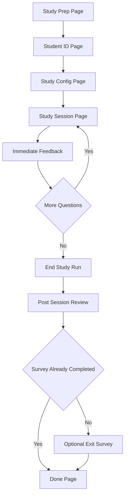
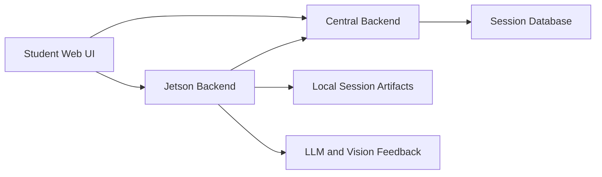

# Study Mode Product Brief

## Summary

Study Mode is a paper-based practice workflow for students. It lets a student solve one or more practice questions on paper, capture their written work with a camera, receive immediate AI feedback, ask follow-up questions through a tutor chat, and then receive an end-of-session summary that rolls up what happened during the run.

The mode is designed as a lower-stakes alternative to the full oral exam flow. Instead of recording a spoken exam, it focuses on guided practice: pick or receive a question, work on paper, capture the work, get feedback, optionally continue to more questions, and finish with high-level takeaways.

The current Study Mode implementation spans:

- A student-facing React flow in `web/src/pages`.
- A Jetson-local FastAPI service in `jetson_runtime/jetson_backend.py`.
- Central backend session and artifact APIs in `backend/routes/sessions.py`.
- Local per-session artifacts under the Jetson sessions directory.
- Optional post-session survey data stored locally on the Jetson and a central per-student completion marker.

## Primary User Experience

### 1. Study Introduction

The student starts on the Study Mode prep screen. The page explains the core loop:

- Solve a problem on paper.
- Show the work to the camera.
- Receive step-by-step feedback.

The page also gives photo quality tips: fill the frame, use bright lighting, avoid glare and shadows, and hold the page steady. From there, the student selects `Begin Study`.

### 2. Student ID Entry

Before configuration, the student is prompted for their assigned numeric student ID. This ID is required for Study Mode and is stored in `sessionStorage` as `study:studentId`.

The ID serves two purposes:

- It associates central sessions with the student.
- It allows the product to avoid repeatedly showing the post-session survey to the same student after they have completed or skipped it once.

The page also creates a simple `study:dayRunId` value based on the current date when one does not already exist. This groups multiple sessions under a day-level visit concept.

### 3. Study Configuration

The student can configure the practice session in one of two ways.

If the central question bank is configured and has available courses, the student can select:

- Course.
- Topic.
- Number of questions.

The requested question count is constrained between 1 and 20. The frontend calls the central question-bank API to select questions, then creates a central session and starts a Jetson study run using the selected practice questions.

If question-bank selection is unavailable or not selected, Study Mode falls back to an assessment-driven question from the assessment exam config. In local development without central configuration, the API client can start a demo question about conditional probability.

### 4. Active Study Session

The study session page is the main working surface.

The student sees:

- The current question.
- A status pill showing states such as ready, capturing, evaluating, feedback ready, or error.
- A live camera preview with an A4-style guide overlay.
- Capture controls.
- A feedback panel.
- An `Ask me anything` tutor chat dock.
- An `End Study` action.

The intended student loop is:

1. Solve the problem on paper.
2. Use the preview to frame the paper.
3. Capture one or more pages, up to the current capture limit.
4. Select `I'm done - evaluate my pages`.
5. Read the immediate feedback.
6. Ask follow-up questions if needed.
7. Continue to the next question when available.
8. End the study session.

The current capture limit is five pages per question.

### 5. Immediate Feedback

Immediate feedback is generated after the student captures paper and requests evaluation. The Jetson backend stores the captured image or images for the current question, calls the vision feedback pipeline, and writes immediate feedback artifacts into the question folder.

The frontend polls the Jetson state endpoint every 2.5 seconds and renders the latest markdown feedback when available.

The immediate feedback is not just a transient UI output. It becomes part of the session record and is later used as source material for the end-of-session summary.

### 6. Tutor Chat

During the study session, the student can use an `Ask me anything` chat. The current implementation supports a full-session-context tutor response path.

The tutor prompt is designed to be:

- Friendly and patient.
- Grounded in the current study context.
- Concise enough for phone-sized screens.
- Math-aware, using KaTeX-safe `$...$` or `$$...$$` formatting.
- Consistent with the graded capture notes.

Tutor turns are stored in the runtime state and logged as study events.

### 7. End-of-Session Review

When the student ends the study run, the Jetson backend aggregates the session's captures and immediate feedback, asks an LLM to build a student-facing summary, writes the summary locally, and posts it to the central backend as session artifacts.

The review page then polls the central backend until `study_feedback` is ready.

The student sees three standardized sections:

- High-level takeaways.
- Areas to improve.
- Next steps.

These sections are intended to summarize the in-session feedback across all captures and questions, not to re-grade the session from scratch.

### 8. Optional Exit Survey

After the review page, the student is routed to an optional exit survey unless the central backend says that this student has already completed or skipped the Study Mode survey before.

The current survey asks:

1. Helpfulness: 1 = not helpful, 5 = very helpful.
2. Ease of use: 1 = hard to use, 5 = very easy.
3. Question difficulty: 1 = very easy, 5 = very difficult.
4. Would use again: Yes or No.
5. What did you like about this session?
6. What did you hate or find frustrating?
7. What would have made this session better for you today?
8. Anything else we should know about your experience today?
9. How did you find the responses? Were they too vague, unclear, too detailed, or otherwise unhelpful?

The survey can be skipped. Skipping does not submit survey answers to the Jetson survey endpoint, but it does mark the central per-student survey gate as completed with a skipped marker so the same student is not asked again in future Study Mode sessions.

If the student submits the survey, all rating questions are required. Written responses are optional and capped at 5000 characters.

## Current Product Flow

## System Architecture

Study Mode uses a hybrid architecture.

The central backend owns durable sessions, student IDs, question-bank selection, and cross-session markers such as whether a student has completed or skipped the survey.

The Jetson backend owns the local, real-time study run. It manages camera capture, image upload, immediate grading, tutor chat, local artifacts, and end-of-session summarization.

The web frontend coordinates both systems:

- It creates a central session when central is configured.
- It starts a corresponding Jetson study run using the central session ID.
- It polls Jetson for active run state.
- It polls central for post-session summary artifacts.
- It submits or skips the optional survey.

## Key Frontend Surfaces

### `StudentStudyPrepPage`

Introduces Study Mode and routes the student into the ID page.

### `StudentStudyIdPage`

Collects and validates a numeric student ID. Stores it in browser session storage and passes it forward to configuration.

### `StudentStudyConfigPage`

Lets the student select question-bank practice parameters when available. It can also fall back to assessment-backed practice. It starts the central session and Jetson run.

### `StudentStudySessionPage`

Provides the active study experience:

- Camera preview.
- Capture and evaluate controls.
- Immediate feedback display.
- Multi-question progression.
- Tutor chat.
- End-study action.

The page disables `End Study` while capture or grading is still in progress, so the final summary does not race ahead of immediate feedback generation.

### `StudentStudyReviewPage`

Polls central session detail until `study_feedback` is available, then renders the three-section student summary.

### `StudentExitSurveyPage`

Provides an optional survey. Submit writes survey data locally on the Jetson and marks central completion. Skip only marks central completion with skip metadata.

## Key Backend Endpoints

### Jetson Study Endpoints

- `POST /jetson/study-guide/runs`: create a local study run.
- `GET /jetson/study-guide/runs/{session_id}/state`: return active run state for polling.
- `POST /jetson/study-guide/runs/{session_id}/capture`: capture from the Jetson camera.
- `POST /jetson/study-guide/runs/{session_id}/capture-upload`: accept a JPEG from the browser camera preview.
- `POST /jetson/study-guide/runs/{session_id}/grade`: evaluate captured pages for the current question.
- `POST /jetson/study-guide/runs/{session_id}/next-question`: advance to the next practice question.
- `POST /jetson/study-guide/runs/{session_id}/action`: handle tutor actions and AMA chat.
- `POST /jetson/study-guide/runs/{session_id}/end`: generate post-session summary and post artifacts to central.
- `POST /jetson/study-guide/runs/{session_id}/survey`: persist optional survey answers locally.
- `POST /jetson/study-guide/runs/{session_id}/client-event`: log best-effort frontend telemetry.

### Central Session Endpoints Used By Study Mode

- `POST /sessions`: create a central session with `assessment_id`, optional `student_id`, and `device_info`.
- `GET /sessions/{session_id}`: fetch session detail, including `study_feedback` and `study_teacher_summary`.
- `POST /sessions/{session_id}/artifacts`: receive Jetson-produced study artifacts.
- `GET /sessions/study-survey-status?student_id=...`: check whether the student has completed or skipped the Study Mode survey.
- `POST /sessions/{session_id}/study-survey-completed`: mark the session's student as survey-completed, optionally with `skipped: true`.

## Data Captured

### Browser Session Storage

The frontend currently stores lightweight session continuity data:

- `study:studentId`: current assigned student ID.
- `study:dayRunId`: current day grouping ID.
- `study:assessmentId:{sessionId}`: assessment ID used for a session.
- `study:studentId:{sessionId}`: student ID used for a session.
- `study:practiceQuestions:{sessionId}`: selected practice questions for recovery.
- `study:studyPlan:{sessionId}`: course, topic, requested count, and selected question IDs.

This storage is used for navigation continuity and Jetson run recovery after backend restarts.

### Central Session Data

The central session stores:

- `assessment_id`.
- `student_id`.
- `device_info`, including `source: web-student-ui`, `mode: study`, and optional `study_plan`.
- `artifacts`, including Study Mode outputs such as `study_feedback`, `study_teacher_summary`, `session_dir_uri`, and `mode: study`.
- Survey completion markers such as `study_survey_completed`, `study_survey_completed_at`, and, for skips, `study_survey_skipped` and `study_survey_skipped_at`.

### Jetson Local Artifacts

The Jetson stores local artifacts under the configured sessions directory. For Study Mode, the main paper artifacts include:

- Captured paper images, grouped by question folder such as `paper/q0`, `paper/q1`, and so on.
- `paper_feedback.json`: structured immediate feedback for the latest grading pass in a question folder.
- `paper_feedback.md`: markdown immediate feedback for the latest grading pass in a question folder.
- `study_feedback.json`: end-of-session student feedback and teacher summary.
- `interactions.jsonl`: append-only event log.
- `interactions.json`: finalized readable interaction log.
- `survey.json`: optional survey response, only when submitted.

### Event Logging And Metrics

Study Mode logs key events such as:

- Run started.
- Question shown.
- Capture events.
- Capture or grading errors.
- Evaluation clicked.
- Feedback generated.
- Tutor chat turns.
- Page visibility and unload events.
- Survey submitted.
- Run ended.

These logs provide a timeline of student behavior and system behavior during the practice session.

## Feedback Generation Model

Study Mode has two levels of feedback.

### Immediate Feedback

Immediate feedback is generated from one or more captured paper images for the current question. The output includes structured JSON and human-readable markdown.

This is shown directly to the student inside the active study session.

### End-of-Session Summary

The final review summary is generated after the run ends. It aggregates the captures and the immediate feedback. The summarizer is prompted to produce one JSON object with:

- `question`.
- `high_level_takeaways`.
- `areas_to_improve`.
- `next_steps`.

For multi-question runs, the summary is still a single aggregate report across all questions and captures.

The prompt asks the model to use a warm, respectful, second-person coaching voice and to ground every bullet in the per-capture feedback. It specifically avoids harsh or shaming language.

## Survey And Student Gating

Study Mode now treats the survey as optional but still uses a central per-student gate.

When the student submits the survey:

- The Jetson writes `survey.json`.
- The Jetson logs a `survey_submitted` event.
- The central backend marks `study_survey_completed: true`.

When the student skips the survey:

- The Jetson survey endpoint is not called.
- The central backend marks `study_survey_completed: true`.
- The central backend also stores `study_survey_skipped: true`.

Future sessions check only the central completion status for the student. This means either submitting or skipping suppresses the survey in later Study Mode sessions for that student.

## Current Strengths

- The product supports real paper work rather than forcing students into a text box.
- Students get feedback during the study session, not only at the end.
- Multi-page captures allow students to show more complete written work.
- Multi-question question-bank study is supported when central question-bank data is configured.
- The end-of-session summary provides a more digestible roll-up than raw per-capture feedback.
- The tutor chat gives students a way to ask clarifying questions in context.
- Student ID association enables per-student metrics and survey gating.
- The optional survey reduces friction while still collecting feedback from students who are willing to provide it.

## Current Limitations And Product Gaps

- The system relies on a Jetson-local runtime for active study state. If that runtime is lost, the frontend attempts recovery, but active in-memory details can still be fragile.
- Immediate feedback artifacts currently use shared `paper_feedback.json` and `paper_feedback.md` files per question folder, so aggregation attaches the shared feedback to the latest capture when per-capture files are unavailable.
- The central survey gate is global per student, not per course, topic, day, or experiment condition.
- The post-session survey is optional, so survey data can be sparse.
- End-of-session feedback depends on the immediate feedback pipeline and LLM summarization, so failures can result in empty but well-shaped feedback sections.
- The frontend can poll indefinitely for review feedback when central is not configured or artifacts never arrive.
- The current question difficulty survey asks about perceived difficulty but does not automatically join that answer to specific question-bank difficulty metadata in the UI.

## Useful Product Metrics To Track

The current implementation already creates useful raw signals for Study Mode KPIs. Product analytics can be built around:

- Study sessions started.
- Study sessions completed.
- Student IDs with at least one session.
- Questions attempted per session.
- Captures per question.
- Capture retries or capture failures.
- Time from question shown to first capture.
- Time from evaluation click to feedback ready.
- Number of tutor chat turns.
- Number of sessions where students ask for clarification.
- Number of sessions that reach end-of-session summary.
- Survey submit rate versus skip rate.
- Helpfulness, ease of use, question difficulty, and would-use-again ratings.
- Qualitative themes from liked, disliked, improvements, anything else, and response quality answers.

## Open Product Questions

- Should survey completion remain global per student, or should it reset by course, topic, study day, cohort, or experiment?
- Should skipped surveys be counted separately in product dashboards from completed surveys?
- Should immediate feedback be versioned per capture rather than attached to the latest capture in a question folder?
- Should the review page have a timeout and fallback state if central never receives artifacts?
- Should Study Mode expose teacher-facing summaries and flags in a dedicated instructor dashboard?
- Should the product use the day run ID to create a daily study summary across multiple sessions?

